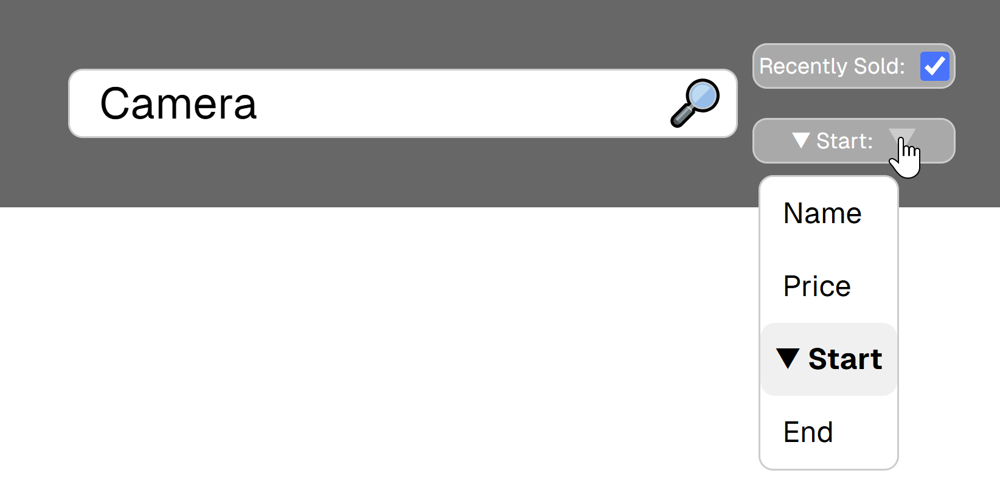
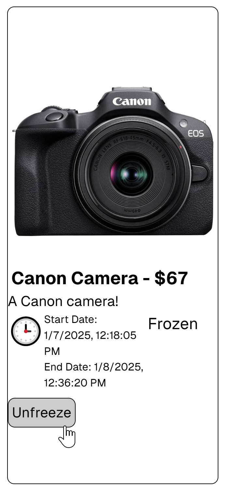

# Auction House

This is an Auction House application created using Typescript, NextJS, and AWS. It is for the graduate course CS 509: Design of Software Systems at WPI.

Link to active site: [Auction House](http://auctionhouse2024.s3-website-us-east-1.amazonaws.com/)

Note: Active site has been taken down to prevent any charges from AWS. Please refer to images below to see examples of the auction house.

## Authors

* Alexander Beck ([GitHub](https://github.com/AlexanderBeck0))
* Emilia Krum ([GitHub](https://github.com/MurkingtonWizard))
* Nate Prickitt ([GitHub](https://github.com/prickittn))
* Brent Weiffenbach ([GitHub](https://github.com/BrentWeiffenbach))

## Project Details

The Auction House consists of three main actors: [Seller](#seller), [Buyer](#buyer), and [Customer](#customer). Additionally, there is a fourth actor, [Admin](#admin), which controls the freezing and unfreezing of items and managing the Auction House itself.

### Seller

A Seller is the only actor able to sell items on the Auction House. A Seller can...

* [Create Account](#create-account)
* [Close Account](#close-account)
* [Login Account](#login-account)
* [Add Item](#add-item)
* [Remove Inactive Item](#remove-inactive-item)
* [Edit Item](#edit-item)
* [Publish Item](#publish-item)
* [Review Items](#review-items)
* [Fulfill Item](#fulfill-item)
* [Unpublish Item](#unpublish-item)
* [Archive Item](#archive-item)
* [Request Item Unfreeze](#request-item-unfreeze)

#### Create Account

A customer is able to create an account by going to create account. Alternatively, there is a link provided within the login page that redirects the customer to the register page. A customer cannot create an account with the username of an already existing account or an already closed account.

#### Close Account

A seller is able to close an account that does not have any items that are active. The seller cannot reopen the account. The username will be reserved, and an account cannot be created with the seller's username again.

#### Login Account

A seller can login to their account through the login page. The seller cannot log into an account that has already been closed.

#### Add Item

A seller can add an item to their account if they are active. The item will initially be inactive, and the seller has to add all the information such as the item name, image, description, and initial price.

#### Remove Inactive Item

An active seller can remove an inactive item, which will **permanently delete** the item.

#### Edit Item

An active seller can edit an inactive item.

#### Publish Item

An active seller can publish an item that has all the required information for an item (name, description, initial price, image, end date). The item cannot be edited.

#### Review Items

A seller can review their items to see which ones are inactive (not yet published), active (waiting for more bids), failed (time has expired without any bids), completed (time has expired with bids) and archived (item has been fulfilled).

#### Fulfill Item

An active seller is responsible for fulfilling an item whose ending time has expired. The item cannot be frozen. Funds are withdrawn from winning buyer. Fulfilling an item archives it.

#### Unpublish Item

An active seller can unpublish an active item that does not have any current bids. Unpublishing an item makes the item inactive.

#### Archive Item

An active seller can archive an inactive item. An archived item cannot be unarchived.

#### Request Item Unfreeze

If a seller's item is frozen, the seller can request the item be unfrozen by Admin.

### Buyer

A Buyer is the only actor able to place bids on an item. A Buyer can...

* [Open Account](#open-account)
* [Close an Account](#close-an-account)
* [Login](#login)
* [Add Funds](#add-funds)
* [Search Recently Sold](#search-recently-sold)
* [Sort Recently Sold](#sort-recently-sold)
* [View Item](#view-item)
* [Place Bid](#place-bid)
* [Purchase Item](#purchase-item)
* [Review Active Bids](#review-active-bids)
* [Review Purchases](#review-purchases)

#### Open Account

A customer is able to create a buyer account by going to create account. Alternatively, there is a link provided within the login page that redirects the customer to the register page. A customer cannot create an account with the username of an already existing account or an already closed account. They will select buyer from a dropdown to create a buyer account.

#### Close an Account

A buyer is able to close an account that does not have any active bids. The buyer cannot reopen the account. The username will be reserved, and an account cannot be created with the buyer's username again.

#### Login

A buyer can login to their account through the login page. The buyer cannot log into an account that has already been closed.

#### Add Funds

A buyer can add funds to their account on their account page. They can add a positive integer to the add funds entry box, click add funds, and the funds will be added to their account. Funds must be positive integers.

#### Search Recently Sold

A buyer can search for items that were recently sold (within 24 hours). A sold item is one that has been fulfilled.

#### Sort Recently Sold

A buyer can sort the items that were recently sold based on criteria. Such criteria include name, price, and time sold.

#### View Item

A buyer can view an item with more information than a Customer. The buyer will see all bid information for the item. The item is viewable until 24 hours has passed since the item was sold.

#### Place Bid

A buyer can place a bid on an item that is active. The buyer must specify the bid amount, in whole positive numbers. The buyer must have enough funds within their account to place the bid. The funds will only be withdrawn from the buyer when the seller fulfills the item.

#### Purchase Item

After a seller places an item For Sale, it is able to be purchased by the buyer. It is a one time purchase, with the buyer needing the required amount of funds to purchase the item.

#### Review Active Bids

A buyer can review their own bids that are active.

#### Review Purchases

A buyer can review any purchases/bids that they have made in the past.

### Customer

A Customer is the only actor that does not require logging in. Customers have the capability to [Search Items](#search-items), [Sort Items](#sort-items), and [View Items](#view-items).

#### Search Items

A Customer can search all active items using keywords (as a potential substring of name or description ignoring type) and price ranges.

Examples of search keywords include ITEM | name | price | start date | end date.

#### Sort Items

A Customer can sort all active items by price, date (published date and expiration date).

#### View Items

A Customer can view an active item (with only the highest bid shown, or initial if there are no bids) and see its description and any of its images.

### Admin

There only exists one Admin within the Auction House. Admin has the ability to [Freeze](#freeze-item) and [Unfreeze](#unfreeze-item) items. Additionally, Admin can [Generate Auction Report](#generate-auction-report) and [Generate Forensics Report](#generate-forensics-report).

As of iteration 1: Admin can also view the database data on their account page.

#### Freeze Item

An Admin can freeze items. Frozen items are unable to be bid on, and unless unfrozen, will fail. Sellers are able to request their frozen items be unfrozen.

#### Unfreeze Item

An Admin can unfreeze items. An unfrozen item will return to being Active, with all bids in place.

#### Generate Auction Report

An Admin can generate an auction report. The auction report includes the amount of funds that the auction house has.

#### Generate Forensics Report

An Admin can generate a forensics report. The forensics report includes all items that are completed but not fulfilled.
